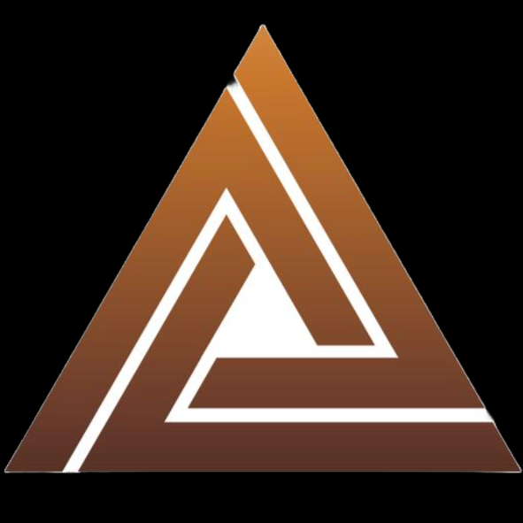

  

<h2 align="center">Delta</h3>

  

    AI-powered merge conflict detection and resolution.
  

## About The Project

<strong>Video:</strong>

<video src="https://github.com/user-attachments/assets/e3be0456-e10d-422e-bfba-4b4f6fcb6eb9" controls width="600"></video>

Your IDE for dealing with the one thing vibe coders HATE… MERGE CONFLICTS! 

Startups typically need to build extremely fast. This leads to merge conflicts inexperienced developers cannot handle. 

Delta leverages AI to properly reason about which changes are most appropriate to keep or delete.

##  Tech Stack
Front End : HTML/CSS, TYPESCRIPT, REACT
BACKEND: GO, Postgresql, Gemini AI
Tools:  DEBEAVER,

## Authors:
Tahmid Ahmed
Shadman Farhan
Angela Yu
Alfardil Alam

##  How to Install

brew install go

go mod tidy

brew install golang-migrate

npm i -g corepack

corepack enable pnpm

cd js && pnpm i

make static file/index.html

How to run:

Backend:
go run main.go or just go-dev

Front end:
pnpm run dev

Download Gemini:
go get google.golang.org/genai

